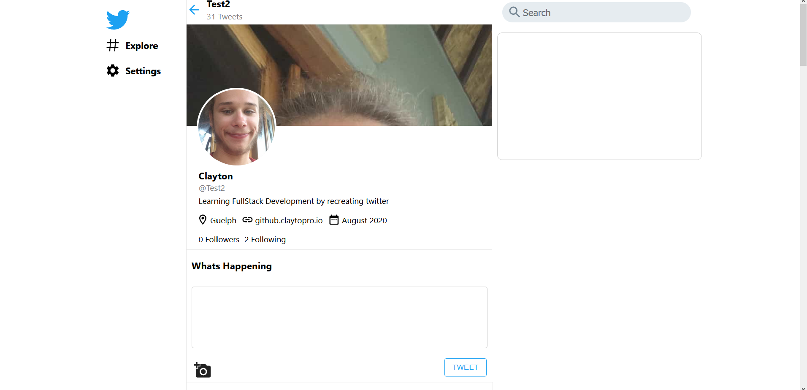
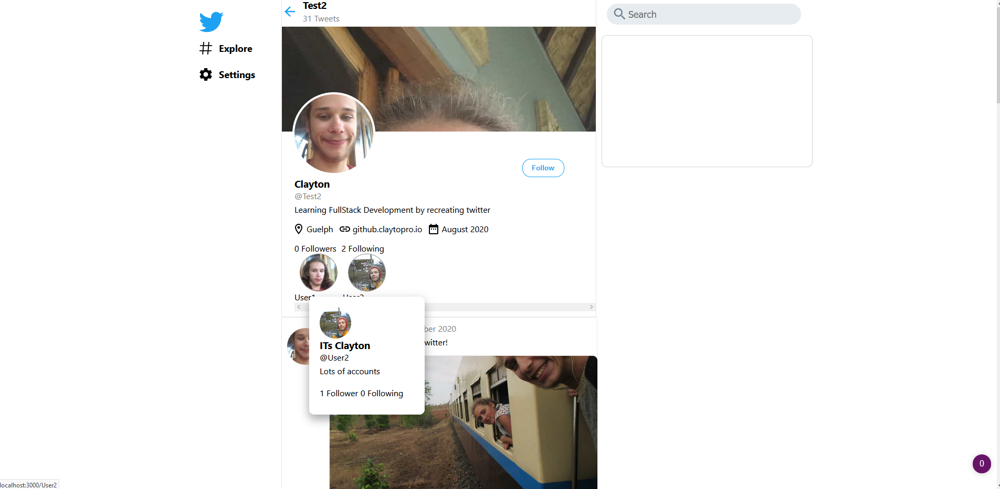
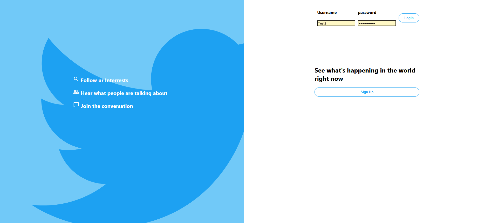

# TwitterClone
Remaking Twitter with ReactJs, Nodejs Express and MongoDb   
Also incorporating material-ui components in front-end  

When User is logged in make a Tweet  

When Your just visiting another user's page  

Logging In  

To Run 
change DATABASE_URI in ./Backend/.env to your mongodb uri  
run node ./server from ./Backend  
run npm start from ./Front_end  

